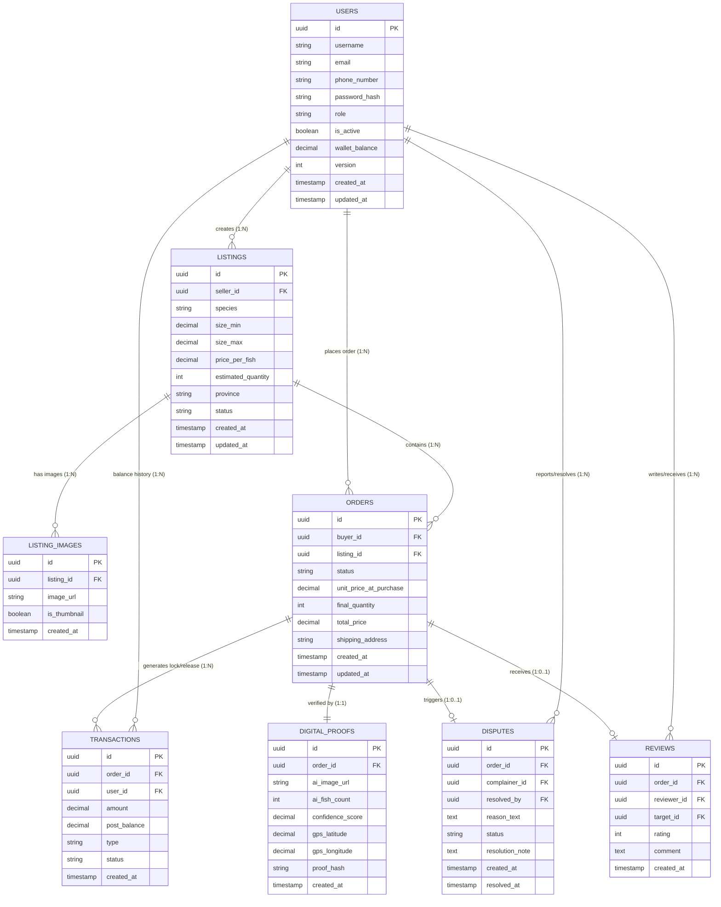

# 1. PHÂN TÍCH THIẾT KẾ CƠ SỞ DỮ LIỆU (DATABASE DESIGN) - TOÀN DIỆN

Dự án AquaTrade AI sử dụng CSDL **PostgreSQL** để đảm bảo tính toàn vẹn dữ liệu (ACID) cho các giao dịch liên quan đến ví tiền (Escrow) và đơn hàng. Dưới đây là thiết kế chi tiết (Full Scale) cho hệ thống thực tế.

## 1.1. Chi tiết các bảng (Tables)

### Bảng 1: `users` (Tài khoản & Ví hệ thống)
Lưu thông tin định danh và số dư ví. Áp dụng Optimistic Locking (@Version) để chống lỗi concurrency (Lost Update) khi Rút/Nạp tiền.
- `id` (UUID - PK): Định danh duy nhất.
- `username` (VARCHAR - Unique): Tên đăng nhập.
- `email` (VARCHAR - Unique): Email chống mất tài khoản & nhận hóa đơn.
- `phone_number` (VARCHAR): SĐT liên hệ giao nhận cá.
- `password_hash` (VARCHAR): Mật khẩu đã được băm.
- `full_name` (VARCHAR): Họ và tên đầy đủ.
- `role` (ENUM): Vai trò (`BUYER`, `SELLER`, `ADMIN`).
- `is_active` (BOOLEAN): Đánh dấu tài khoản có bị khóa hay không (Mặc định: TRUE).
- `wallet_balance` (DECIMAL): Số dư khả dụng trong ví.
- `version` (INT): Cột Optimistic Locking quản lý tránh deadlock.
- `created_at`, `updated_at` (TIMESTAMP).

### Bảng 2: `listings` (Tin đăng bán cá giống)
Quản lý các lô cá giống do Người bán đăng tải.
- `id` (UUID - PK): Định danh.
- `seller_id` (UUID - FK): Nối tới `users`.
- `title` (VARCHAR): Tiêu đề lô cá.
- `category` (ENUM): Nhóm sản phẩm lớn (`CA` - Các loại Cá, `TOM` - Các loại Tôm, `CUA` - Cua/Ghẹ, `KHAC` - Khác). Dùng để lọc nhanh trên Marketplace.
- `species` (VARCHAR): Tên giống cụ thể (VD: "Cá Tra", "Tôm Thẻ Chân Trắng"). Chi tiết hơn `category`.
- `size_min`, `size_max` (DECIMAL): Khoảng kích thước (cm) thường dùng cho cá giống (tối ưu hơn size cứng).
- `price_per_fish` (DECIMAL): Đơn giá mỗi con.
- `estimated_quantity` (INT): Số lượng ước tính.
- `province` (VARCHAR): Tỉnh/Thành phố trại giống (Bắt buộc để người mua tính toán logistics vận chuyển cá tươi sống).
- `moderation_note` (TEXT - Nullable): Ghi chú của Admin khi từ chối hoặc yêu cầu chỉnh sửa.
- `status` (ENUM): Trạng thái (`PENDING_REVIEW`, `AVAILABLE`, `SOLD`, `HIDDEN`, `REJECTED`). **Seller đăng → `PENDING_REVIEW` → Admin duyệt → `AVAILABLE` hoặc `REJECTED`**.
- `created_at`, `updated_at` (TIMESTAMP).

### Bảng 3: `listing_images` (Hình ảnh minh họa)
Bộ sưu tập ảnh thực tế của lô cá do người bán chụp ban đầu (Quan hệ 1-N với `listings`).
- `id` (UUID - PK).
- `listing_id` (UUID - FK).
- `image_url` (VARCHAR): Link URL ảnh trên Cloudinary/S3.
- `is_thumbnail` (BOOLEAN): Đánh dấu ảnh bìa.
- `created_at` (TIMESTAMP).

### Bảng 4: `orders` (Đơn hàng & Phòng giao dịch)
Quản lý luồng thương lượng, Video Call và chốt số lượng (Escrow workflow).
- `id` (UUID - PK).
- `buyer_id` (UUID - FK).
- `listing_id` (UUID - FK).
- `status` (ENUM): Trạng thái (`PENDING`, `ESCROW_LOCKED`, `IN_VIDEO_CALL`, `COUNTING_AI`, `COMPLETED`, `DISPUTED`, `CANCELLED`).
- `unit_price_at_purchase` (DECIMAL): Giá trị "chốt" tại thời điểm đặt hàng, tránh gian lận tự ý sửa giá sản phẩm từ Seller.
- `final_quantity` (INT): Số lượng thực tế đếm cuối cùng.
- `total_price` (DECIMAL): Tổng tiền thanh toán dựa trên kết quả AI chốt.
- `shipping_address` (TEXT): Địa chỉ vận chuyển cá giống vật lý đến tay khách.
- `created_at`, `updated_at` (TIMESTAMP).

### Bảng 5: `transactions` (Ví Escrow & Sao kê dòng tiền)
Lịch sử biến động số dư / Lệnh đóng băng tiền.
- `id` (UUID - PK).
- `order_id` (UUID - FK - Nullable): Đơn hàng liên đới.
- `user_id` (UUID - FK): Tài khoản phát sinh giao dịch.
- `amount` (DECIMAL): Số tiền giao dịch.
- `post_balance` (DECIMAL): "Số dư sổ cái" ngay sau khi giao dịch này cộng/trừ. Tối ưu đối soát tài chính mà không cần quét lại từ đầu lịch sử.
- `type` (ENUM): Loại GD (`ESCROW_LOCK`, `ESCROW_RELEASE`, `REFUND`, `TOP_UP`, `WITHDRAW`).
- `payment_method` (ENUM - Nullable): Phương thức nạp tiền vào ví (`VNPAY`, `MOMO`, `BANK_TRANSFER`). Chỉ có giá trị khi `type = TOP_UP`.
- `vnpay_reference` (VARCHAR - Nullable): Mã tham chiếu giao dịch từ cổng VNPay để đối soát. Chỉ có giá trị khi `payment_method = VNPAY`.
- `status` (ENUM): Trạng thái lệnh (`SUCCESS`, `FAILED`, `PENDING`).
- `created_at` (TIMESTAMP).

### Bảng 6: `digital_proofs` (Bằng chứng số điện tử - Linh hồn hệ thống)
Lưu kết quả AI xác định, dùng làm chứng cứ điện tử minh bạch không thể chối cãi.
- `id` (UUID - PK).
- `order_id` (UUID - FK - Unique).
- `ai_image_url` (VARCHAR): Link file ảnh đóng khung đỏ (Bounding Box).
- `ai_fish_count` (INT): Số con cá hệ thống tự đếm.
- `confidence_score` (DECIMAL): Độ chính xác Model xuất ra.
- `gps_latitude`, `gps_longitude` (DECIMAL): Tọa độ địa lý lúc đo đếm.
- `proof_hash` (VARCHAR): Bảng băm SHA-256 (tạo thành từ các biến trên) chống Admin chọc vào DB mạo danh.
- `created_at` (TIMESTAMP).

### Bảng 7: `disputes` (Khiếu nại & Xử lý Tranh chấp)
Lưu vết khi Order có biến cố, giải quyết thông qua nền n8n và Admin.
- `id` (UUID - PK).
- `order_id` (UUID - FK - Unique).
- `complainer_id` (UUID - FK): Người report (Buyer/Seller).
- `reason_text` (TEXT): Lý do.
- `status` (ENUM): Hành động (`OPEN`, `RESOLVED`, `REJECTED`).
- `resolved_by` (UUID - FK - Nullable): ID Admin giải quyết.
- `resolution_note` (TEXT): Phán quyết của Trọng tài Sàn.
- `created_at`, `resolved_at` (TIMESTAMP).

### Bảng 8: `reviews` (Đánh giá Hệ thống Mua Buôn)
Tính năng Rating tạo uy tín Marketplace.
- `id` (UUID - PK).
- `order_id` (UUID - FK - Unique).
- `reviewer_id` (UUID - FK): Thường là người mua đánh giá.
- `target_id` (UUID - FK): ID người bán cung cấp cá.
- `rating` (INT): Sao (1-5 đánh giá).
- `comment` (TEXT): Lời nhận xét.
- `created_at` (TIMESTAMP).

---

## 1.2. Sơ đồ Thực thể liên kết TOÀN DIỆN (ERD)

