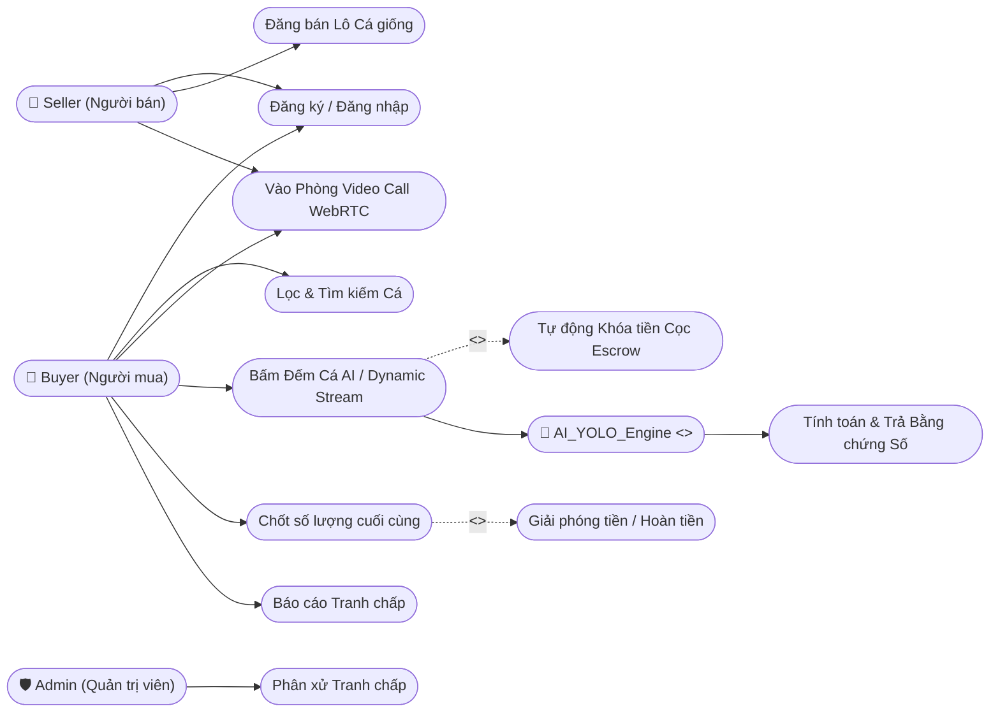

# CHƯƠNG 2: PHÂN TÍCH VÀ THIẾT KẾ HỆ THỐNG AQUATRADE AI (CHUẨN ĐỒ ÁN)

Chương này đi sâu vào việc phân tích yêu cầu nghiệp vụ, định hình chân dung người dùng, lưu đồ luồng thao tác và thiết kế hệ thống phần mềm.

## 2.1. Phân tích yêu cầu (Requirements Analysis)

### 2.1.1. Yêu cầu chức năng (Functional)
1. **Quản lý con người và Cửa hàng:** Người dùng có thế lên Sàn đăng ký làm Buyer hoặc đăng ký lên Seller (kèm KYC). Seller đăng bán các lô cá giống.
2. **Giao tiếp Real - time (WebRTC):** Hệ thống cấp một "Phòng Giao Dịch Ảo". Ở đó người mua và bán bật Video Call nhìn trực tiếp khay cá thực tế.
3. **Nghiệm thu điện tử qua AI (Server-Assisted AI):** Khi người mua bấm "Bắt đầu đếm", Frontend sẽ băm luồng Video thành nhiều khung hình và gửi liên tục qua WebSocket lên máy chủ AI. Thuật toán YOLOv8 + Kalman Filter + 95th Percentile sẽ chạy phân tích mảng động để tìm Ngưỡng Đỉnh (lúc cá tản ra đẹp nhất) nhằm chốt được số lượng chính xác tuyệt đối.
4. **Thanh toán đảm bảo (Escrow Wallet):** Người mua nạp tiền, khi bắt đầu mua, tiền bị khóa giữ bởi Sàn. Chỉ khi quá trình Chụp + Xác nhận AI thành công thì tiền mới tự động chuyển cho Seller.
5. **Xử lý tranh chấp và CSKH tự động (n8n Automation):** Tích hợp Chatbot Rule-based (cây quyết định) hỗ trợ tra cứu đơn tự động. Khi có tranh chấp, hệ thống điều phối mở Ticket và thông báo Telegram khẩn cấp đến Admin can thiệp.

### 2.1.2. Yêu cầu phi chức năng (Non-Functional)
- **Hiệu năng:** Xử lý đếm AI thời gian thực trả kết quả dưới 2 giây. Hình ảnh stream qua WebRTC độ phân giải tối ưu (720p) không nghẽn băng thông.
- **Bảo mật bất biến:** Các bức ảnh AI trả về không thể chỉnh sửa thủ công (chống tráo đổi ảnh). Lưu trữ với chuỗi Hash bảo vệ.

## 2.2. Sơ đồ Usecase Tổng quát (Usecase Diagram)



## 2.3. Quy trình chuẩn SOP khay nghiệm thu
Để AI hoạt động vớt độ chuẩn xác > 95%, người bán phải tuân thủ SOP:
1. Dùng khay đếm màu trắng/xanh nhạt để tạo độ tương phản.
2. Mực nước trong khay không vượt quá 5cm để tránh cá nhòe do khúc xạ ánh sáng sâu.
3. Camera điện thoại chiếu góc vuông góc 90 độ từ trên xuống, khoảng cách 30 - 40cm.

## 2.4. Biểu đồ Tuần tự (Sequence Diagram) - Luồng Nghiệm Thu Số Bất Biến

Đây là luồng cốt lõi sáng tạo nhất của Đồ án (Luồng giải quyết bài toán cốt lõi).

```mermaid
sequenceDiagram
    participant B as Buyer (React)
    participant S as Seller (React)
    participant P2P as WebRTC Stream
    participant JB as Core Backend (Java)
    participant AI as AI Service (Python)
    
    B->>JB: Create Order (listing_id)
    JB-->>B: Trả về Room_ID, khóa tiền Escrow
    B->>JB: Connect WebSocket
    S->>JB: Connect WebSocket & Enter Room
    B<->S: WebRTC Signalling (Trao đổi SDP/ICE qua Java)
    B<->P2P: Bắt đầu Video Call trực tiếp P2P
    S<->P2P: Truyền hình ảnh khay cá liên tục
    
    B->>P2P: Bấm nút [Bắt đầu Đếm AI]
    loop Dynamic Streaming WebSocket
        P2P-->>B: Cắt 3-5 frames/giây (Low_fps)
        B->>JB: Gửi chuỗi Frame qua WebSockets
        JB->>AI: Relay liên tục sang Python 
        Note right of AI: YOLO + Kalman + 95th Percentile<br>Đang chạy tìm Ngưỡng đỉnh ổn định...
    end
    AI-->>JB: BẮT ĐƯỢC ĐỈNH! Return JSON (max_count=105, best_image_base64)
    JB->>ObjectStorage: Upload 'best_image' lấy URL tĩnh (S3/Cloudinary)
    JB->>JB: Tạo mã SHA-Hash chống giả mạo
    JB->>JB: Lưu URL tĩnh và Hash vào DB bảng Digital_Proofs
    
    JB-->>B: Trả về dữ liệu Bằng chứng (WebSocket/REST)
    JB-->>S: Trả về Bằng chứng cho Seller (WebSocket)
    
    B->>JB: Bấm Xác Nhận (Hoàn thành nghiệm thu)
    JB->>JB: Cập nhật Orders = COMPLETED
    JB->>JB: Đối soát: Tạo lệnh REFUND (nếu đếm hụt) & ESCROW_RELEASE (nhả cho Seller)
    JB-->>B: Giao dịch kết thúc mỹ mãn
    JB-->>S: Giao dịch kết thúc mỹ mãn
```

## 2.5. Sơ đồ Kiến trúc Hệ thống đa tầng (Microservices Deployment Architecture)

```mermaid
flowchart TD
    subgraph Frontend [Web Frontend - ReactJS/Vite]
        UI([Giao diện hiển thị])
        WebRTC([Module Video Peer-to-Peer])
    end

    subgraph CoreBackend [Core Backend - Java Spring Boot]
        Auth[Xác thực JWT]
        Escrow[Ví Thanh toán / Escrow]
        Logics[Logic đơn hàng, DB]
    end

    subgraph AIService [AI Service - Python FastAPI]
        Endpoint[API Endpoint]
        YOLO[(Mô hình YOLOv8 .pt)]
    end
    
    subgraph DatabaseLayer [Persistence]
        PSQL[(PostgreSQL)]
        ObjectStorage[(Cloud Object Storage<br>S3/Cloudinary)]
    end

    UI <-->|REST API / WebSocket| CoreBackend
    UI <-->|WebRTC P2P Stream| UI
    CoreBackend <-->|Lưu trữ Transaction & Proofs| PSQL
    CoreBackend -->|Upload File ảnh tĩnh| ObjectStorage
    CoreBackend -->|Truyền mảng Frame động (WebSocket)| Endpoint
    Endpoint --> YOLO
```

*Mô hình trên đảm bảo Frontend gọn nhẹ, Backend chuyên về giao dịch không bị đơ, còn Python chuyên về toán học, không ảnh hưởng tài nguyên lẫn nhau.*
